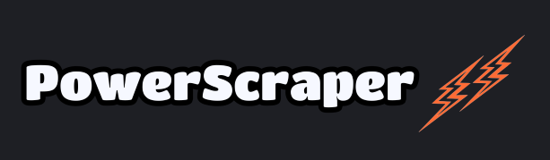
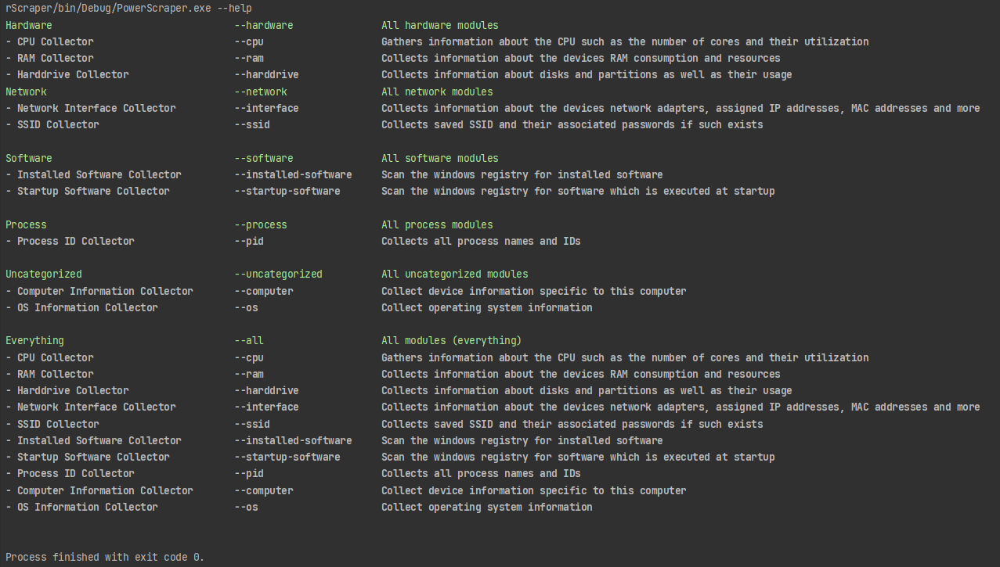

[![Contributors][contributors-shield]][contributors-url]
[![Forks][forks-shield]][forks-url]
[![Stargazers][stars-shield]][stars-url]
[![Issues][issues-shield]][issues-url]
[![MIT License][license-shield]][license-url]

[![Workflow Status][workflow-shield]][workflow-url]

 

  

![Windows][windows-badge]
![Linux][linux-badge]
![OSX][osx-badge]
![FreeBSD][freebsd-badge]
<h2>Work in Progress</h2>
<h3 align="center">PowerScraper</h3>
  

    An advanced, lightweight system information tool 
     
    <a href="https://github.com/blue-hexagon/PowerScraper/releases"><strong>Get Latest Version »</strong></a>
     
     
    <a href="https://github.com/blue-hexagon/PowerScraper/#demo">View Screenshots</a>
    ·
    <a href="https://github.com/blue-hexagon/PowerScraper/issues">Report Bug</a>
    ·
    <a href="https://github.com/blue-hexagon/PowerScraper/issues">Request Feature</a>

  

## About The Project

This project is the a reimplementation of a previous project I did in Python called [WinScraper](https://github.com/blue-hexagon/WinScraper); this version is build with C#11 and .NET Core 7.

It comes in two packages: a CLI tool which is a downloadable executable, and a library which is available as a NuGet package.

It collects information about devices running on Windows, Linux, OsX, and FreeBSD which is then serialized into a wide array of
data formats such as YAML, JSON, XML, CSV, TOML, INI and CSV.

### Development Status
| Collector Name                             | Category   | ![w-top] | ![l-top] | ![m-top] | ![b-top] |
|:-------------------------------------------|:------------------------------------|----------|----------|----------|----------|
| CPU                                        | All.Hardware                        | ![w]     | ![l2]    | ![m2]    | ![b2]    |
| RAM                                        | All.Hardware                        | ![w2]    | ![l2]    | ![m2]    | ![b2]    |
| Interface                                  | All.Network                         | ![w2]    | ![l2]    | ![m2]    | ![b2]    |
| SSID                                       | All.Network                         | ![w2]    | ![l2]    | ![m2]    | ![b2]    |
| PID                                        | All.Process                         | ![w2]    | ![l2]    | ![m2]    | ![b2]    |
| Installed Software                         | All.Software                        | ![w2]    | ![l2]    | ![m2]    | ![b2]    |
| Startup Software                           | All.Software                        | ![w2]    | ![l2]    | ![m2]    | ![b2]    |
| Computer                                   | All.System                          | ![w2]    | ![l2]    | ![m2]    | ![b2]    |
| Operating System                           | All.System                          | ![w2]    | ![l2]    | ![m2]    | ![b2]    |

## Demo & Screenshots

Run the executable without any arguments for a brief overview of argument options.
Or run it with the `--help` option for more detailed help - example:

(<a href="#readme-top">back to top</a>)

## Getting Started
### Installation

#### Install as Application

1. Download the latest binary
2. Manually add the path of the binary to your environment PATH variable.

#### Install as Library

1. Download the latest NuGet package

(<a href="#readme-top">back to top</a>)

## Contributing

The project is pretty easy to extend and you won't need to concern yourself with any of the codebase besides
all the scraping logic that is contained within `Core.Scraping.Modules.<ModuleName>`, where you find the modules and collectors that do the handle the scraping.

If you have a suggestion that would make this better, please fork the repo and create a pull request. You can also
simply open an issue. Also, don't forget to give the project a star ⭐!

1. Fork the Project
2. Create your Feature Branch (`git checkout -b feature/AmazingFeature`)
3. Commit your Changes (`git commit -m '...'`)
4. Push to the Branch (`git push origin feature/AmazingFeature`)
5. Open a Pull Request

(<a href="#readme-top">back to top</a>)

## Versioning

We use [SemVer](http://semver.org/) for versioning. For the versions available, see
the [tags on this repository](https://github.com/blue-hexagon/powerscraper/tags).

(<a href="#readme-top">back to top</a>)

## Authors

- **Blue-Hexagon** - *Initial work* - [Blue-Hexagon](https://github.com/blue-hexagon)

See also the list of [contributors](https://github.com/blue-hexagon/powerscraper/contributors) who participated in this
project.

(<a href="#readme-top">back to top</a>)

## Contact

Contact me on Discord at `manjana#3559` for any matter related to this project.

(<a href="#readme-top">back to top</a>)

## License

This project is distributed under the MIT License - see [LICENSE.md](LICENSE) for more details.

(<a href="#readme-top">back to top</a>)

<!-- MARKDOWN LINKS & IMAGES -->
<!-- https://www.markdownguide.org/basic-syntax/#reference-style-links -->

[contributors-shield]: https://img.shields.io/github/contributors/blue-hexagon/PowerScraper.svg?style=for-the-badge

[contributors-url]: https://github.com/blue-hexagon/PowerScraper/graphs/contributors

[forks-shield]: https://img.shields.io/github/forks/blue-hexagon/PowerScraper.svg?style=for-the-badge

[forks-url]: https://github.com/blue-hexagon/PowerScraper/network/members

[stars-shield]: https://img.shields.io/github/stars/blue-hexagon/PowerScraper.svg?style=for-the-badge

[stars-url]: https://github.com/blue-hexagon/PowerScraper/stargazers

[issues-shield]: https://img.shields.io/github/issues/blue-hexagon/PowerScraper.svg?style=for-the-badge

[issues-url]: https://github.com/blue-hexagon/PowerScraper/issues

[license-shield]: https://img.shields.io/github/license/blue-hexagon/PowerScraper.svg?style=for-the-badge

[license-url]: https://github.com/blue-hexagon/PowerScraper/blob/master/LICENSE.md

[workflow-shield]: https://github.com/blue-hexagon/PowerScraper/actions/workflows/dotnet.yml/badge.svg

[workflow-url]: https://github.com/blue-hexagon/PowerScraper/actions/workflows/dotnet.yml/badge.svg

[product-screenshot]: .readme/logo.png

[windows-badge]: https://img.shields.io/badge/Windows-0078D6?style=for-the-badge&logo=windows&logoColor=white
[linux-badge]: https://img.shields.io/badge/Linux-FCC624?style=for-the-badge&logo=linux&logoColor=black
[osx-badge]: https://img.shields.io/badge/mac%20os-000000?style=for-the-badge&logo=apple&logoColor=white
[freebsd-badge]: https://img.shields.io/badge/freebsd-AB2B28?style=for-the-badge&logo=freebsd&logoColor=white

[w-top]: https://raw.githubusercontent.com/blue-hexagon/PowerScraper/master/.readme/icon/windows-enabled-icon.png "↓ Windows Feature Status ↓"
[l-top]: https://raw.githubusercontent.com/blue-hexagon/PowerScraper/master/.readme/icon/linux-enabled-icon.png "↓ Linux Feature Status ↓"
[m-top]: https://raw.githubusercontent.com/blue-hexagon/PowerScraper/master/.readme/icon/osx-enabled-icon.png "↓ macOS (OSX) Feature Status ↓"
[b-top]: https://raw.githubusercontent.com/blue-hexagon/PowerScraper/master/.readme/icon/bsd-enabled-icon.png "↓ FreeBSD Feature Status ↓"

[w]: https://raw.githubusercontent.com/blue-hexagon/PowerScraper/master/.readme/icon/windows-enabled-icon.png "Windows collector is implemented ☺"
[l]: https://raw.githubusercontent.com/blue-hexagon/PowerScraper/master/.readme/icon/linux-enabled-icon.png "Linux collector is implemented ☺"
[m]: https://raw.githubusercontent.com/blue-hexagon/PowerScraper/master/.readme/icon/osx-enabled-icon.png "macOS (OSX) collector is implemented ☺"
[b]: https://raw.githubusercontent.com/blue-hexagon/PowerScraper/master/.readme/icon/bsd-enabled-icon.png "FreeBSD collector is implemented ☺"

[w2]: https://raw.githubusercontent.com/blue-hexagon/PowerScraper/master/.readme/icon//windows-disabled-icon.png "Windows collector is not implemented"
[l2]: https://raw.githubusercontent.com/blue-hexagon/PowerScraper/master/.readme/icon/linux-disabled-icon.png "Linux collector is not implemeneted"
[m2]: https://raw.githubusercontent.com/blue-hexagon/PowerScraper/master/.readme/icon/osx-disabled-icon.png "macOS (OSX) collector is not implemented"
[b2]: https://raw.githubusercontent.com/blue-hexagon/PowerScraper/master/.readme/icon/bsd-disabled-icon.png "FreeBSD collector is not implemented"